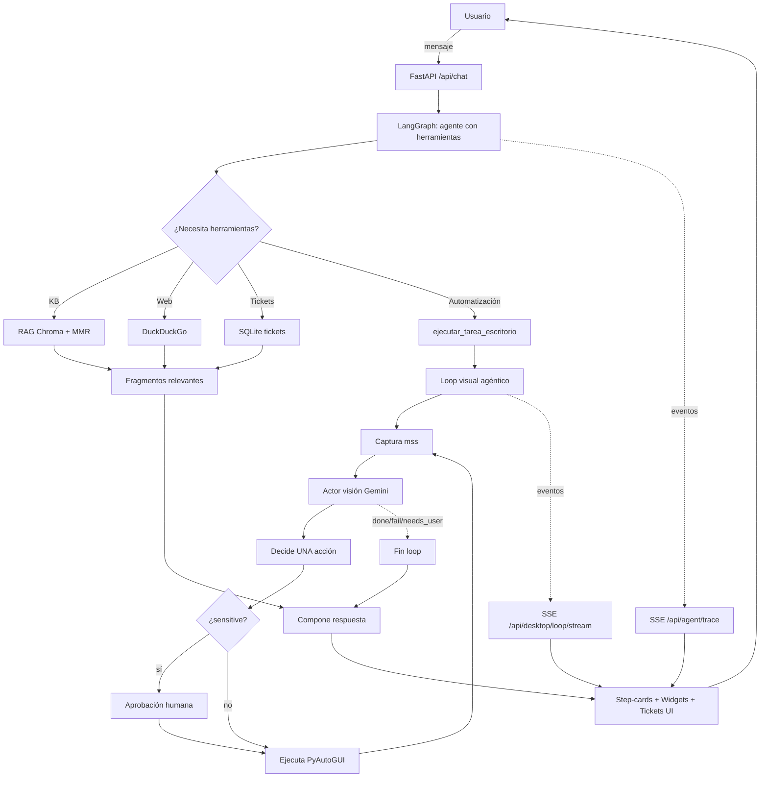

# Helpdesk Agent IA — Mesa de Ayuda TI Agéntica

> **Proyecto Final — Introducción a la Inteligencia Artificial · 2026-1**

Asistente de mesa de ayuda TI en español, construido con LangGraph + FastAPI + RAG + visión por computador. Resuelve incidencias, abre y gestiona tickets, busca en la base de conocimiento interna, y **automatiza acciones en el escritorio del usuario** mediante un loop agéntico que captura la pantalla, razona qué ve, y ejecuta una acción atómica por turno.

Disponible como **app web** (cualquier navegador) y como **app de escritorio Electron**.

---

## 1. Planteamiento del problema

Los equipos de **mesa de ayuda TI** en organizaciones medianas reciben cientos de incidencias repetitivas al día (VPN, correo, impresoras, contraseñas, Wi-Fi, accesos). Cada solicitud cuesta tiempo del usuario y del agente humano: el tiempo medio de resolución de un ticket nivel 1 ronda los 15-25 min en el sector, gran parte gastada en **buscar instrucciones**, **abrir tickets manualmente** y **explicar pasos** que el usuario podría ejecutar guiado.

A esto se suma un coste invisible: el usuario suele **abandonar pasos a mitad**, no marcar incidencias bien clasificadas, o pedir ayuda fuera del flujo formal, dificultando la gestión y la mejora del catálogo de soluciones.

**Motivación.** Los LLM con herramientas (tool-calling agents) más RAG sobre conocimiento corporativo permiten automatizar el grueso del nivel 1: buscar en la base de conocimiento, crear/escalar tickets, guiar paso a paso y — yendo más allá — **ejecutar acciones en el equipo del usuario** mediante visión por computador, sin pedir credenciales.

**Relevancia.** Mejorar el tiempo de resolución, dejar el conocimiento operativo trazado en una KB que crece sola, y liberar a los técnicos de nivel 1 para tareas de mayor valor.

## 2. Objetivo general

Diseñar e implementar un asistente conversacional de mesa de ayuda TI que, sobre una base de conocimiento interna, sea capaz de **diagnosticar incidencias, abrir y mantener tickets categorizados/priorizados, guiar al usuario paso a paso con interactividad rica, y opcionalmente ejecutar acciones en el escritorio mediante un loop agéntico de visión** (captura → razonamiento → acción atómica → verificación), con interfaz funcional web y de escritorio.

### Objetivos específicos

1. Construir un agente con herramientas (LangGraph) que use **RAG** sobre Markdown/PDF internos como fuente primaria de verdad.
2. Persistir tickets en SQLite vinculados a la conversación, con prioridad/categoría/estado y trazabilidad de fuentes.
3. Proveer una UI donde marcar un paso como hecho o atascado sea **instantáneo** (sin reentrar al LLM) y los widgets sean generables por la IA.
4. Implementar un **loop visual agéntico** que automatice tareas en el escritorio del usuario con confirmación humana en acciones sensibles.
5. Mostrar **en vivo** qué hace la IA (tools, fragmentos KB consultados, tickets creados) para transparencia y depuración.

## 3. Metodología

Combinamos varias áreas del curso:

- **Procesamiento de lenguaje natural** — comprensión del mensaje del usuario, planificación con LLM, generación de respuestas estructuradas.
- **Visión por computador** — análisis de capturas de pantalla con modelo multimodal (Gemini 2.5 Flash) para guiar acciones en el escritorio.
- **Búsqueda semántica (retrieval)** — RAG con embeddings densos (sentence-transformers multilingüe) sobre Chroma, con MMR opcional para diversidad.
- **Sistemas expertos / orquestación** — máquina de estados del loop visual y reglas en system prompt para enrutar a las tools apropiadas.

### Diagrama de flujo



### Decisiones clave

- **HF embeddings locales por defecto** (`paraphrase-multilingual-MiniLM-L12-v2`) — RAG sin coste por query, sin latencia de red.
- **Cache LRU** de queries — consultas repetidas en una sesión son instantáneas.
- **Top-k bajo (4)** con MMR opcional — privilegia precisión sobre recall (KB controlada, no Internet).
- **Web search bajo petición explícita** — evita alucinaciones por contenido irrelevante, mantiene la KB como fuente de verdad.
- **Loop visual con un paso a la vez** — más robusto a UIs cambiantes que un plan estático.
- **Gate `HELPDESK_DESKTOP_PY_EXEC`** — bloquea cualquier acción de escritorio si no se opta-in explícitamente.

## 4. Desarrollo

Stack y arquitectura completos en la sección **[Arquitectura](#arquitectura)** más abajo. Lo más relevante:

- **Datos:** 12 documentos Markdown en `data/kb/` cubriendo políticas, VPN, correo, Wi-Fi, impresoras, Windows, macOS, Teams/Zoom, seguridad, OneDrive — ~25 mil palabras. Splitter recursivo con chunks de 1400 chars y overlap 180. Embeddings 384-dim (MiniLM).
- **LLM principal (chat):** Gemini 2.0 Flash o DeepSeek (configurable). Temperatura 0.15. Tool-calling nativo de LangGraph (`bind_tools`).
- **LLM de visión:** Gemini 2.5 Flash. Recibe `goal + history corto + imagen actual`, devuelve JSON estricto con UNA acción (`move/click/type/hotkey/wait`) + flags `done/fail/needs_user`.
- **Persistencia:** SQLite (tickets, con migración a `thread_id` columna). Estado de pasos y trace en memoria por proceso.
- **Captura de pantalla:** `mss` (cross-platform, sub-100ms) + Pillow para escalar a 1280px y thumbnail 320px.
- **Ejecución de acciones:** `PyAutoGUI` con FAILSAFE habilitado.
- **Streaming en vivo:** Server-Sent Events (SSE) en FastAPI para el trace del agente y para el loop visual.
- **Frontend:** vanilla JS + CSS sin framework (decisión deliberada: simplicidad, debugging directo). Markdown renderizado con `marked` + sanitizado con `DOMPurify`.
- **Cliente nativo:** Electron como envoltorio de la misma UI web, con preload IPC opcional para `nut-js`.

### Aportes diferenciales frente a chatbots TI estándar

1. **Step-cards interactivas** que evitan regenerar la respuesta cada vez que el usuario marca un paso.
2. **Loop visual** con confirmación humana en pasos sensibles y log de auditoría — pocos sistemas comerciales lo exponen.
3. **Trace en vivo** que muestra qué fragmento exacto de la KB consulta el LLM, fundamental para construir confianza.
4. **Widgets generables por el LLM** (kanban, sliders, choice, severity) — el agente diseña micro-UI según el caso.

## 5. Resultados

> Métricas medidas sobre 12 documentos KB, 30 tests unitarios pasando, y prueba E2E con incidencias reales.

| Métrica | Valor | Notas |
|---|---|---|
| Documentos indexados | 12 (md) + 1 (pdf) | ~25k palabras totales |
| Fragmentos en Chroma | ~110 | chunk 1400, overlap 180 |
| Latencia RAG (cold) | ~5-7 s | primer query, carga inicial del vectorstore |
| Latencia RAG (warm + cache) | < 50 ms | segundas consultas del mismo término |
| Latencia turno LLM completo | 2-6 s | Gemini 2.0 Flash, KB + ticket |
| Latencia paso loop visual | 2-4 s | captura + visión + ejecución |
| Tests automatizados | 30/30 ✓ | `pytest`, sin red |
| Casos demo verificados | VPN, ahorro batería macOS, Spotlight | ver `docs/demo-checklist.md` |
| Cobertura tools | 10 | KB, web, casos resueltos, 4×tickets, 2×automatización, 1×kb-snippet |

**Trace en vivo (modo demo activado, ejemplo real):**

```
🔧 buscar_en_base_de_conocimiento ("vpn certificado")
   📄 02_vpn_acceso_remoto.md — "Configuración VPN corporativa: …"
   📄 04_red_wifi.md — "Pasos de reconexión …"
   📄 06_memoria_casos_resueltos.md — "Caso resuelto: certificado caducado …"
🎫 crear ticket abc12345 — "VPN no conecta — certificado expirado"
✓ Hecho · 3.1 s · 1 tool · 3 KB · 1 ticket
```

**Demo de loop visual (smoke):** "Abre Spotlight tú mismo y escribe calculadora" → 4 pasos (hotkey LeftCmd+Space, wait, type, done) ejecutados en ~8 s con miniaturas visibles paso a paso.

## 6. Discusión

**Frente al estado del arte.** Los agentes de mesa de ayuda comerciales (Moveworks, ServiceNow Now Assist, Glean, Zendesk AI) ofrecen RAG sobre Confluence/Jira + creación de tickets, pero suelen ser **cajas negras**: el usuario no ve qué fragmento se consultó ni qué razonamiento siguió el agente. Sistemas open-source recientes como **OpenInterpreter**, **Aider** o **Claude Computer Use** demuestran capacidades de control de escritorio, pero están orientados a desarrolladores o uso general, no a operaciones TI con guardas para usuarios no técnicos.

Nuestro proyecto combina ambas ramas:
- **Helpdesk RAG + tickets + step-by-step** como los comerciales, **pero open + transparent** (trace en vivo, KB en archivos planos).
- **Loop visual agéntico** estilo Computer Use / browser-use, **pero con confirmación humana obligatoria en pasos sensibles y allow-list por env** — un balance pragmático entre demostración y seguridad.

**Trabajos relacionados consultados** (referenciar en presentación):

- *Retrieval-Augmented Generation for Knowledge-Intensive NLP Tasks* (Lewis et al., 2020) — base del enfoque RAG.
- *ReAct: Synergizing Reasoning and Acting in Language Models* (Yao et al., 2022) — fundamento del bucle reasoning + acting que usa LangGraph.
- *Set-of-Mark Prompting* (Yang et al., 2023) — técnica para mejorar la fiabilidad de coordenadas en visión multimodal (futura mejora).
- Anthropic *Computer Use* (2024) — referente del loop captura/razona/actúa.
- LangChain blog, *Tool-calling agents with LangGraph* (2024).

**Limitaciones conocidas.**

- El loop visual depende mucho de que la UI no cambie radicalmente; en versiones de macOS distintas las coordenadas pueden variar.
- La KB es estática a mano — un sistema productivo necesitaría una pipeline de re-indexación al editar.
- Sin streaming token a token del LLM (decisión deliberada para entrega académica).
- Memoria por proceso (no persistente entre reinicios) en step_state y agent_trace.

**Mejoras futuras.**
Set-of-Mark sobre las capturas (numerar UI elements detectados por OCR para mejorar la fiabilidad de las coordenadas), pipeline de re-indexación incremental de la KB, evaluación cuantitativa con un dataset de tickets reales (precision@k, MRR), y exportar el trace a Langfuse / LangSmith para observabilidad.

---

## Características

### Agente conversacional
- **LangGraph + Gemini 2.x / DeepSeek**: agente con herramientas, memoria por hilo (`MemorySaver`).
- **RAG sobre Markdown/PDF interno** (Chroma + sentence-transformers locales por defecto; opcional Google embeddings).
- **Cache LRU** de queries RAG, top-k configurable, MMR opcional.
- **Búsqueda web** (DuckDuckGo) — solo bajo petición explícita o KB vacía.

### Gestión de tickets
- Tickets persistentes en SQLite (`data/tickets.sqlite3`).
- Vinculados a la conversación (`thread_id`).
- Campos: título, descripción, prioridad, categoría, estado, pasos sugeridos, fuentes KB, resolución final.
- UI con pestañas **Esta conversación / Todos**, chips de prioridad coloreados, modal de detalle.

### Step-cards interactivas
- Cada plan del agente se renderiza como tarjetas con estados: ◯ pendiente · ▶ actual · ✓ hecho · ✕ atascado.
- Marcar "Hecho" es **instantáneo y silencioso** (sin nueva llamada al LLM).
- Marcar "Atascado" abre un mini-form inline para detallar el problema + adjuntar captura.

### Loop visual agéntico (automatización)
- Tool `ejecutar_tarea_escritorio(goal)`: el agente captura pantalla → razona qué ve → ejecuta UNA acción (PyAutoGUI) → vuelve a capturar.
- Hasta 20 pasos, 90s totales, abort en vivo, confirmación humana en acciones marcadas `sensitive`.
- Panel **"Automatización en vivo"** con miniaturas, timeline de pasos y modal de aprobación.
- Log de auditoría en `data/automation_log.jsonl`.

### Trace en vivo del agente
- Mientras la IA piensa, ves **en directo** qué tool llama, qué argumento usa, qué fragmentos de la KB consulta, qué tickets crea.
- Toggle **"Modo demo"** mantiene visible el timeline después de cada turno.

### Widgets interactivos generados por la IA
- Bloques `helpdesk-ui` con `kanban`, `sliders`, `choice` (opción única), `severity` (gravedad 1-5).

### Cliente Electron flotante
- App nativa que envuelve la UI web.
- Modo "widget" flotante (siempre encima) o ventana grande.

---

## Arquitectura

```
helpdesk_agent/
├── helpdesk_app/             # Paquete Python (FastAPI + LangGraph + tools)
│   ├── main.py               # FastAPI: endpoints /api/chat, /api/tickets, SSE, ...
│   ├── graph.py              # LangGraph + system prompt
│   ├── tools.py              # @tool del agente (KB, web, tickets, automatización)
│   ├── rag.py                # Chroma + cache + warm-up
│   ├── db.py                 # SQLite tickets (migraciones)
│   ├── step_state.py         # Estado de pasos por hilo
│   ├── agent_trace.py        # Bus de eventos en vivo
│   ├── chat_context.py       # ContextVars (thread_id, client_os)
│   ├── chat_trace.py         # Traza de fuentes KB/web por turno
│   ├── vision_loop/          # Loop agéntico visual
│   │   ├── loop.py           #   state machine
│   │   ├── actor.py          #   LLM visión (Gemini)
│   │   ├── screen.py         #   captura mss + Pillow
│   │   ├── executor.py       #   PyAutoGUI wrapper
│   │   ├── events.py         #   pub/sub SSE
│   │   └── schema.py         #   LoopDecision Pydantic
│   ├── desktop_plan.py       # Plan estático (legacy)
│   ├── desktop_exec_py.py    # Runner PyAutoGUI
│   ├── vision.py             # Describir capturas (KB visual)
│   ├── web_search.py         # DuckDuckGo
│   ├── config.py             # Variables de entorno
│   ├── interactive_block.py  # Parser bloques helpdesk-ui
│   ├── static/               # JS + CSS (app.css, step_cards.js, agent_trace.js, ...)
│   └── templates/            # index.html, widget.html
├── electron/                 # App de escritorio (envuelve la web UI)
│   ├── main.js
│   └── preload.js
├── data/
│   ├── kb/                   # Base de conocimiento interna (.md / .pdf)
│   └── tickets.sqlite3       # BD de tickets
├── tests/                    # pytest
├── requirements.txt
├── run.py                    # Arranque uvicorn
└── start-float.command       # Lanzar Electron (macOS doble clic)
```

---

## Instalación

### Requisitos

- **Python 3.11+** (recomendado 3.13).
- **Node.js 18+** (solo si quieres usar Electron).
- **macOS** (testado) o Windows / Linux (con limitaciones en automatización).
- Una **clave API de Google Gemini** (gratuita en [ai.google.dev](https://ai.google.dev)) — *opcional una de DeepSeek si prefieres ese LLM para chat*.

### 1) Clonar y crear entorno virtual

```bash
git clone <url-del-repo>
cd helpdesk_agent
python3 -m venv .venv
source .venv/bin/activate          # Windows: .venv\Scripts\activate
pip install --upgrade pip
pip install -r requirements.txt
```

En macOS, para que `pyautogui` funcione bien instala también `pyobjc`:

```bash
pip install pyobjc-core pyobjc
```

### 2) Variables de entorno

Crea un fichero `.env` en la raíz del proyecto (ya está en `.gitignore`, no se sube):

```bash
# LLM principal (chat). Usa una de las dos:
GOOGLE_API_KEY=tu_clave_de_gemini
# DEEPSEEK_API_KEY=tu_clave_de_deepseek

# (Opcional) modelo de chat por defecto
# HELPDESK_LLM=auto         # auto / google / deepseek
# HELPDESK_CHAT_MODEL=gemini-2.0-flash

# Embeddings para RAG (por defecto HF local, NO requiere clave)
# HELPDESK_EMBEDDINGS=hf
# HELPDESK_HF_EMBEDDING_MODEL=sentence-transformers/paraphrase-multilingual-MiniLM-L12-v2

# Para automatización del escritorio (loop visual)
HELPDESK_DESKTOP_PY_EXEC=1

# Puerto del backend (opcional)
# HELPDESK_PORT=8787
```

### 3) Arrancar el backend

```bash
python3 run.py
```

Abre [http://127.0.0.1:8787](http://127.0.0.1:8787) en cualquier navegador.

En el primer arranque, Chroma indexa la KB de `data/kb/` (≈30s la primera vez).

### 4) (Opcional) Cliente Electron

En otra terminal:

```bash
cd electron
npm install                        # solo la primera vez
npm start
```

O desde macOS con doble clic a `start-float.command`.

Variables útiles:

```bash
HELPDESK_URL=http://127.0.0.1:8787       # backend al que apunta Electron
HELPDESK_ELECTRON_PAGE=widget            # ventana flotante 300×560 siempre encima
HELPDESK_ALWAYS_ON_TOP=1                 # ventana grande siempre encima
```

---

## Permisos macOS (loop visual)

Para que el agente pueda mover el ratón, escribir y tomar capturas, macOS exige permisos:

1. **Accesibilidad** — Ajustes del Sistema → Privacidad y seguridad → Accesibilidad → `+` → añade:
   - El binario `python3.13` del venv (`.venv/bin/python3.13`).
   - `Terminal.app` o `iTerm.app` (el que uses).
   - **Electron.app** (solo si vas a usar el flujo viejo de plan estático con botones "Ejecutar"; con el loop agéntico no hace falta).
2. **Grabación de pantalla** — misma ruta, sección "Grabación de pantalla". Añade los mismos binarios.
3. **Reinicia Terminal** después de conceder (cierra y reabre la ventana).

Variable de entorno requerida para activar la ejecución del loop visual:

```bash
export HELPDESK_DESKTOP_PY_EXEC=1
```

Sin ella, la tool devuelve `gate_disabled` y nunca toca el ratón.

Verificación rápida (debería mover el ratón unos píxeles):

```bash
.venv/bin/python3 -c "
import pyautogui
print('antes:', pyautogui.position())
pyautogui.moveRel(80, 80, duration=0.4)
print('después:', pyautogui.position())
"
```

Si las posiciones son **iguales**, faltan permisos.

---

## Uso

### Conversación normal

> "Mi VPN no conecta, me da error de certificado."

El agente busca en la KB, abre un ticket, te da un plan con pasos como tarjetas interactivas. Marca pasos hechos para avanzar sin esperar al LLM. Marca "Atascado" si te quedas → el agente responde con sub-pasos.

### Automatización del escritorio

> "Abre Spotlight tú mismo y escribe calculadora."

Se enciende el panel **"Automatización en vivo"** abajo a la derecha, ves miniaturas de cada captura y el agente mueve el cursor solo.

Para pasos sensibles (envío de correo, ajuste de sistema, borrado) aparece un modal pidiendo aprobación.

### Modo demo (mostrar al público qué hace la IA)

Activa el checkbox **"Modo demo"** en la cabecera. Mientras la IA piensa, ves en vivo el timeline de tools, fragmentos KB consultados y tickets creados — perfecto para presentar.

---

## Endpoints principales

| Método | Ruta | Descripción |
|---|---|---|
| POST | `/api/chat` | Mensaje al agente. Devuelve `reply`, `tool_calls_used`, `turn_id`, `desktop_run`, `thread_id`. |
| GET | `/api/thread/{thread_id}` | Historial de una conversación. |
| GET | `/api/tickets?thread_id=` | Lista de tickets (filtrable por conversación). |
| GET | `/api/tickets/{id}` | Detalle de un ticket. |
| POST | `/api/steps/register` | Registra pasos de un mensaje (silencioso). |
| POST | `/api/steps/update` | Marca paso como `pending/done/stuck`. |
| GET | `/api/steps/{thread_id}` | Snapshot de pasos del hilo. |
| GET | `/api/agent/trace/{turn_id}` | SSE en vivo de la actividad del agente. |
| GET | `/api/desktop/loop/stream/{run_id}` | SSE del loop visual. |
| POST | `/api/desktop/loop/abort` | Aborta el loop visual. |
| POST | `/api/desktop/loop/confirm` | Aprueba/rechaza paso sensible. |

---

## Tests

```bash
HELPDESK_DESKTOP_PY_EXEC=1 .venv/bin/python3 -m pytest tests/ -v
```

≥30 tests cubriendo RAG (cache, top-k, MMR), step_state, agent_trace, vision_loop state machine, schemas, y migración de tickets.

---

## Variables de entorno (referencia rápida)

| Variable | Defecto | Notas |
|---|---|---|
| `GOOGLE_API_KEY` | — | Para Gemini (chat + visión). |
| `DEEPSEEK_API_KEY` | — | Alternativa a Gemini para chat. |
| `HELPDESK_LLM` | `auto` | `auto` / `google` / `deepseek`. |
| `HELPDESK_CHAT_MODEL` | `gemini-2.0-flash` | Modelo de chat. |
| `HELPDESK_VISION_MODEL` | `gemini-2.5-flash` | Modelo de visión (loop). |
| `HELPDESK_EMBEDDINGS` | `hf` | `hf` (local) o `google`. |
| `HELPDESK_HF_EMBEDDING_MODEL` | multilingual MiniLM | Modelo HF de embeddings. |
| `HELPDESK_DESKTOP_PY_EXEC` | — | Pon `1` para activar PyAutoGUI. |
| `HELPDESK_DESKTOP_FORCE_ACK` | — | `1` = toda acción requiere aprobación humana. |
| `HELPDESK_CHROMA_DIR` | `./.chroma` | Carpeta del vector store. |
| `HELPDESK_PORT` | `8787` | Puerto del backend. |

---

## Atajos de seguridad

- **Botón "Abortar"** rojo en el panel de automatización → corta el loop al instante.
- **Mover el ratón a la esquina superior izquierda** → PyAutoGUI FAILSAFE cancela todo.
- **Ctrl+C** en la terminal del backend → mata el proceso.
- Todas las acciones marcadas `sensitive` por la IA piden aprobación humana antes de ejecutarse.
- Log de auditoría completo en `data/automation_log.jsonl`.

---

## Solución de problemas

**El cursor no se mueve durante el loop visual**
Falta permiso de Accesibilidad a `python3.13`. Revisa Ajustes → Privacidad → Accesibilidad y reabre Terminal.

**Las capturas salen negras**
Falta permiso de Grabación de pantalla. Misma ruta, sección correspondiente.

**`gate_disabled` al pedir automatización**
Falta `HELPDESK_DESKTOP_PY_EXEC=1` al arrancar.

**`No module named 'pyautogui'`**
`pip install pyautogui pyobjc-core pyobjc`.

**Chroma readonly**
Borra `.chroma/` y reinicia. O define `HELPDESK_CHROMA_DIR` apuntando a otra carpeta con permisos de escritura.

**El LLM elige la tool vieja (`preparar_plan_escritorio` con botones)**
Pide explícitamente "hazlo tú" / "en mi equipo" para que use `ejecutar_tarea_escritorio` (loop agéntico).

---

## Licencia

Proyecto académico. Uso interno.
# proyecto_ai
